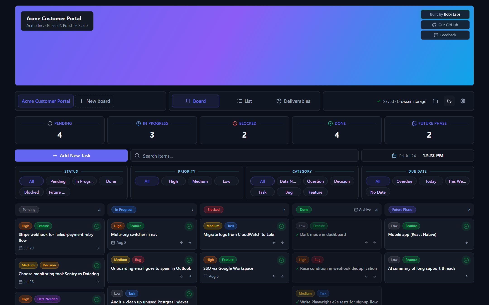
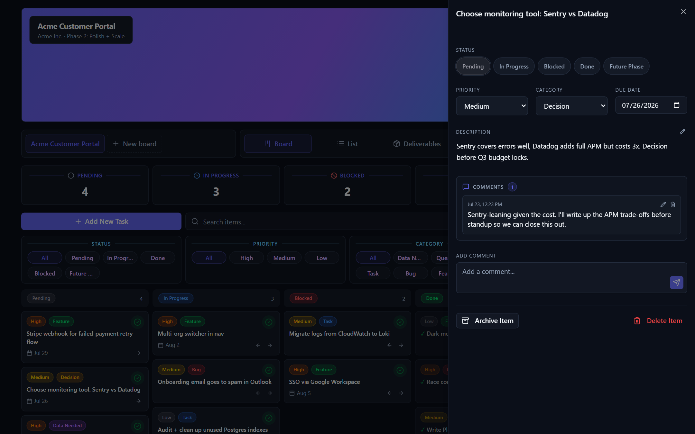
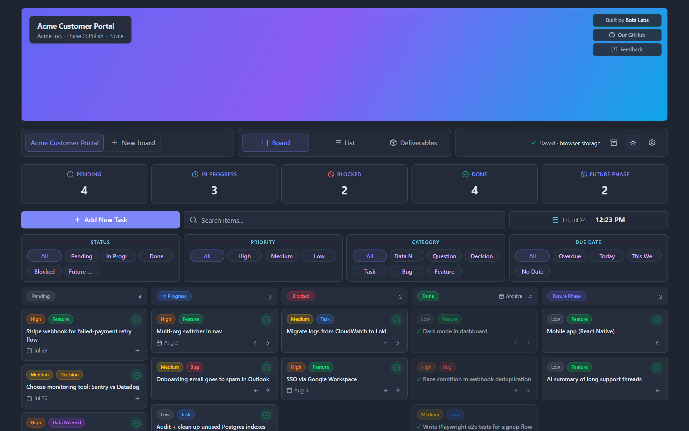

<div align="center">

# Bobi Tracker

**A kanban board that lives in your browser.**
No account. No server. No tracking. Your work never leaves your machine.

[](./LICENSE)
[](#where-your-data-lives)
[](#where-your-data-lives)
[](#where-your-data-lives)

**[Try it now →](https://bobilabs.dev/worktracker)** &nbsp;·&nbsp; nothing to install, nothing to sign up for

<picture>
  <source media="(prefers-color-scheme: dark)" srcset="docs/board-dark.png">
  <source media="(prefers-color-scheme: light)" srcset="docs/board-light.png">
  
</picture>

</div>

## Why this exists

Most task trackers want an account before they will show you a board, then keep
your data on someone else's computer and charge you to get features back. This
one doesn't. There is no sign-up because there is nothing to sign up *to*: the
app is a static site, and your board is a file.

- **Open it, use it.** The first screen has two buttons. One of them loads a
  sample project so you can feel the tool before you commit a single task.
- **Verify the privacy claim yourself.** The app ships a
  `Content-Security-Policy` of `connect-src 'none'` — your *browser* refuses
  every fetch, XHR, and WebSocket the page could attempt, so "no tracking" is
  enforced, not promised. The hosted deployment's headers also lock images,
  fonts, and media to the app itself. Or just unplug from the internet:
  everything keeps working.
- **Leave whenever you like.** Your whole board exports as one readable
  `.json` file. It is yours, it is plain text, it makes sense without this
  app, and the format is documented in [FORMAT.md](./FORMAT.md).

## What you get

|  |  |
|---|---|
| **Kanban board** | Five columns, drag-and-drop, quick-done, move arrows, keyboard-accessible dragging. |
| **List view** | Sortable table with multi-select and bulk status changes for backlog surgery. |
| **Item detail** | Description, priority, category, assignee, due date, and a comment thread per card. |
| **Markdown descriptions** | Bold, lists, `- [ ]` checkboxes, code, and links render right in the card detail and deliverables. Hostile input renders as inert text — the renderer never touches raw HTML. |
| **Quick-add tokens** | Type `fix invoice !high #bug @sam due:fri` and the card lands filed, prioritized, assigned, and dated. Unrecognised tokens stay in the title. |
| **Deliverables** | The scope, build notes, and open questions behind each piece of work. Answer a question and it is stamped and dated; clear the answer and it reopens. |
| **Archive** | Sweep the Done column with one click, or archive any single card from its detail panel. Nothing is deleted: archived cards restore to the column they left, any time. |
| **Filters** | Status, priority, category, assignee, and due date (overdue / today / this week / no date). |
| **Save to a real file** | On Chrome and Edge, point a board at a `.json` file on disk and every change writes straight to it. Keep it in a synced folder, a repo, anywhere you already back things up. |
| **Custom banners** | Give each board its own image. It is resized, compressed, and stored *inside* the board, so it travels with exports and renders offline. |
| **Three themes** | Light, dim, and dark. Dim is the mid-tone for people who find light glaring and dark muddy. |
| **Unlimited boards** | No cap, no trial, no paid tier of this tool. |

<div align="center">
 
</div>

## Where your data lives

In **this browser, on this device**, in `localStorage`. That has one important
consequence, and we would rather say it plainly than bury it:

> **Clearing your browser's site data will erase your boards.**

So:

- **Export regularly.** Settings → *Export board*. One self-contained `.json`
  file, importable on any machine, in any browser, readable without this app.
- **Better: attach a file** (Chrome and Edge). Every change then writes to disk
  *and* to browser storage, and the file on disk is the copy that survives.

Nothing is ever sent anywhere. We have no copy of your data, because we never
had one.

## Running it yourself

```bash
pnpm install
pnpm dev        # http://localhost:3000
```

Build a static site (the output is plain files; no server needed):

```bash
pnpm build      # emits ./out
npx serve out
```

Other scripts: `pnpm typecheck` · `pnpm test`

### Hosting it somewhere

`./out` is the whole application. Drop it on any static host, open
`index.html` from `file://`, or serve it from a USB stick.

One caveat: if you serve it from a **sub-path** rather than a domain root
(GitHub Pages project sites, reverse-proxy mounts), set `BASE_PATH` at build
time or every asset will 404:

```bash
BASE_PATH=/my-subpath pnpm build
```

Leave it unset for a domain root, `file://`, or a desktop build. It is the only
environment variable in the project, and it is optional.

## Free vs. bespoke

This tool is free, MIT licensed, and stays that way. It is deliberately
single-player. The bespoke tier is the same product built around a team:

| | **Bobi Tracker (this repo)** | **Bespoke, by [Bobi Labs](https://bobilabs.dev)** |
|---|---|---|
| Boards, list, deliverables, archive | ✅ | ✅ |
| Accounts and roles | — (none, on purpose) | ✅ Multi-user with role-gated editing |
| Where data lives | Your machine only | Your own hosted database |
| Client-facing views | — | ✅ Read-only "show the work" pages |
| Invoicing per work item | — | ✅ |
| Telegram / Google Drive integration | — | ✅ |
| Deployment | Any static host | Hosted and maintained for you |

Need the right column? **[Talk to us](https://bobilabs.dev/worktracker)**.

## Tech

Next.js (static export) · React · TypeScript · Tailwind · zod ·
[@hello-pangea/dnd](https://github.com/hello-pangea/dnd)

Persistence sits behind a deliberately dumb `StorageAdapter`
(`load` / `save` / `clear`, whole-document). That is what lets the same store
back `localStorage` today, the File System Access API on Chromium, and a
desktop build later, without the UI knowing which one it is talking to.

## Roadmap

- **Desktop app.** A Tauri build with native local files. The storage layer is
  already shaped for it.

## License

MIT. See [LICENSE](./LICENSE). Use it, fork it, sell it, ship it.
